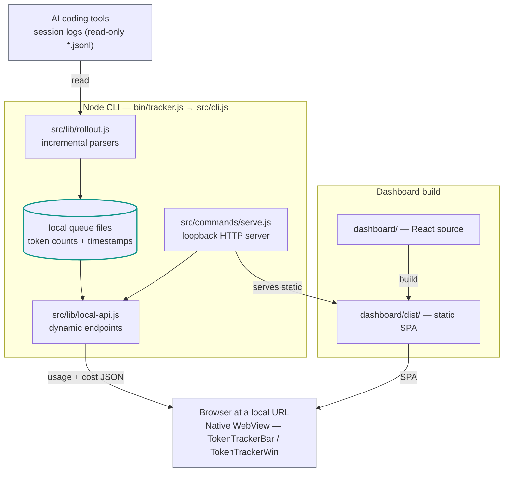

# TokenTracker OpenWiki

This directory is the source-backed engineering map for TokenTracker. It covers
the local runtime, dashboard, native wrappers, and the checks used to keep the
documentation aligned with the repository.

## System diagram



The runtime stores token counts and timestamps only. Prompts, messages, and
conversation bodies are outside the queue and documentation contract.

<details>
<summary>Text version of the diagram</summary>

```text
  AI coding tools
  (logs and hooks)
          |
          v
  +-------------------------+
  | src/lib/rollout.js      |
  | incremental parsers     |
  +-------------------------+
          |
          v
  +-------------------------+
  | local queue files       |
  | token counts + times    |
  +-------------------------+
          |
          v
  +-------------------------+          +--------------------------+
  | Node CLI                |          | dashboard/                |
  | bin/tracker.js          |--------->| React source              |
  | src/cli.js              |  build   | dashboard/dist/           |
  +-------------------------+          +--------------------------+
          |
          | serve
          v
  +-----------------------------------------------+
  | loopback HTTP server                           |
  | src/commands/serve.js                          |
  |   +-- src/lib/local-api.js (dynamic endpoints) |
  |   +-- dashboard/dist (static SPA)              |
  +-----------------------------------------------+
          |                              |
          v                              v
  browser at a local URL          native WebView
                                  TokenTrackerBar / TokenTrackerWin
                                  bundle Node CLI + dashboard output
```

</details>

The diagram above shows the components. For how usage data moves and is
transformed between them, see the [Data flow](architecture/dataflow.md) view.

## Start here

- [Working on this documentation](quickstart.md): the source ledger, the
  regeneration commands, and what the fact checker enforces.
- [Architecture](architecture/overview.md): runtime components and boundaries.
- [Data flow](architecture/dataflow.md): how usage data moves from tool logs to
  the dashboard, with a leveled data-flow diagram.
- [CLI and operations](cli-and-operations.md): CLI command ownership and
  loopback-server behavior.
- [Parsers and sync](parsers-and-sync.md): parser entry points and aggregation.
- [Local API](local-api.md): documented local endpoints.
- [Dashboard routes](dashboard-routes.md): route ownership and route list.
- [Native app boundaries](native-app-boundaries.md): macOS and Windows wrappers.
- [Testing and release](testing-and-release.md): validation and release scope.

## Keep the documentation factual

`CLAUDE.md` is the workflow and release authority. The machine-derived ledger
at `openwiki-facts/source-facts.json` is the authority for documented CLI
commands, local endpoints, dashboard paths, and parser symbols.

```bash
npm run docs:openwiki:extract
npm run docs:openwiki:check
```

For a model-backed local refresh, use `npm run docs:openwiki:update`. For the
independent read-only review, use `npm run docs:openwiki:verify`. Both commands
use credentials from the caller environment; they do not read credentials from
this repository.
